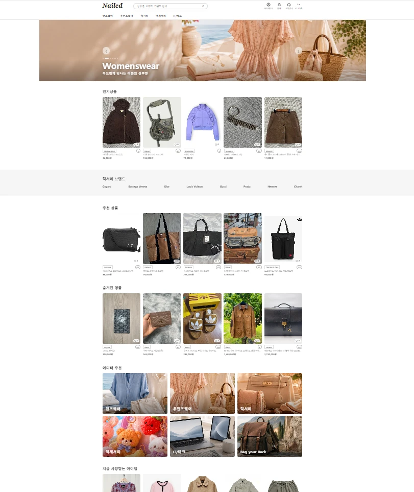
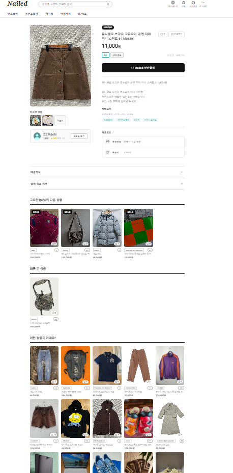
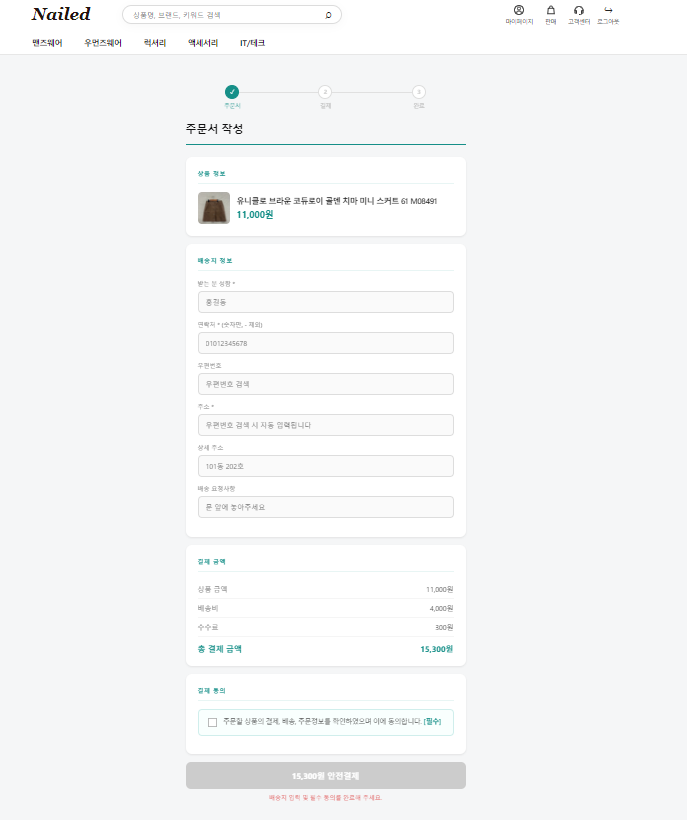
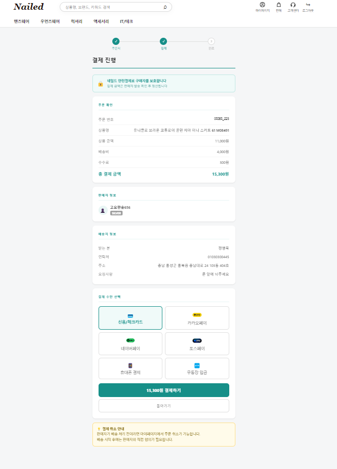
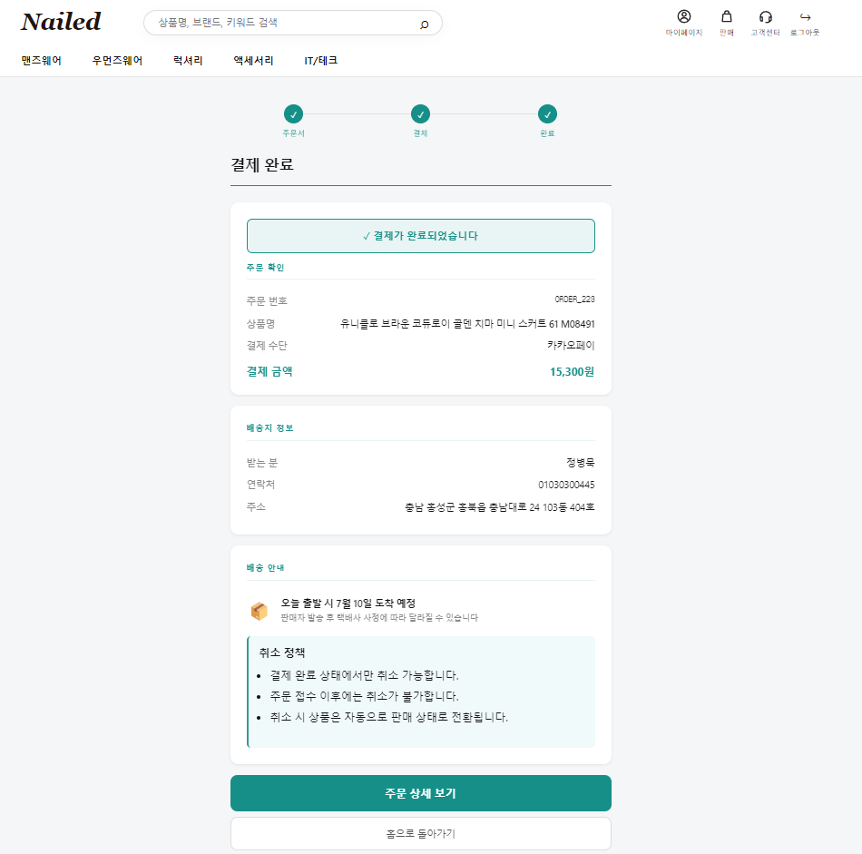
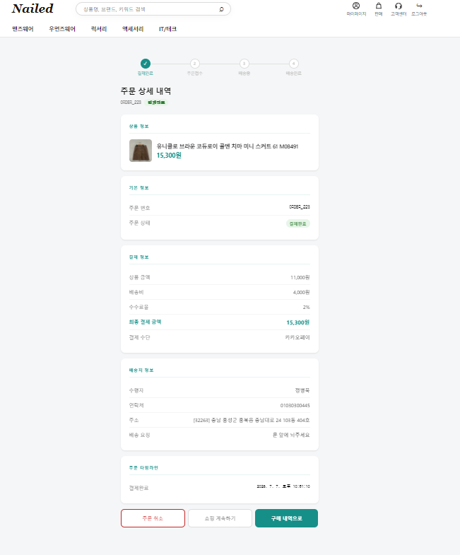
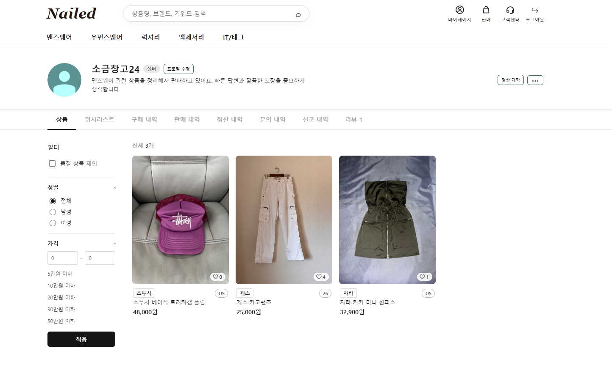
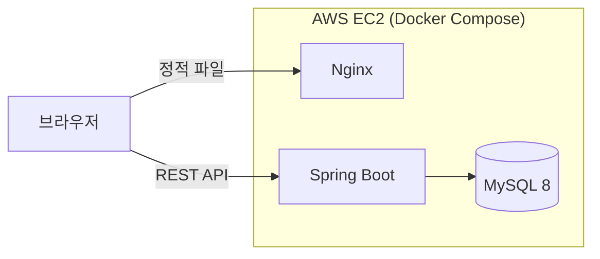
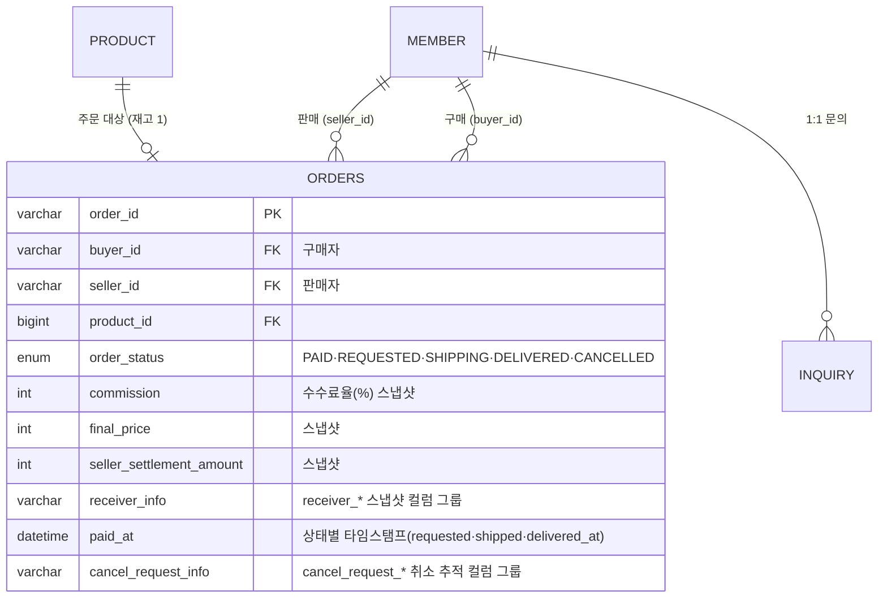

# 🛍️ Nailed — 중고거래 플랫폼

[](https://github.com/jeongbyeongmug/nailed-marketplace/actions/workflows/ci.yml)

## 프로젝트 소개

주문 → 결제 → 정산 → CS로 이어지는 거래 흐름 전체를 구현한 중고거래 웹 서비스입니다.

| 항목 | 내용 |
|------|------|
| 기간 | 2026.04 ~ 2026.06 |
| 인원 | 3명 (도메인 기반 분담) |
| 배포 주소 | [http://52.78.146.81/](http://52.78.146.81/) |
| 테스트 계정 | ID: `wnsdn929` / PW: `qwer1234!` |
| 기술 | Java 21 · Spring Boot 3.5 · Spring Security(JWT) · JPA · MySQL 8 · React · Docker Compose(Nginx) · AWS EC2 |
| 원본 백엔드 저장소 | [byeongminjeong49-ui/nailed_BE](https://github.com/byeongminjeong49-ui/nailed_BE) (실제 개발 커밋 히스토리) |

<details>
  <summary><h3>서비스 화면 보기</h3></summary>

| 홈 | 상품 상세 |
|---|---|
|  |  |

| 주문서 | 결제 |
|---|---|
|  |  |

| 결제 완료 | 주문 상세 |
|---|---|
|  |  |

| 판매자 마이페이지 |
|---|
|  |

</details>

<br/>

## 담당 역할

주문 · 결제 · 정산 · CS(1:1 문의) · 마이페이지 · 관리자(주문/문의) — 거래 흐름 전체를 담당했습니다.

### 주문 (Order)
- **주문 생성·조회·상태 전이** : 주문 생성 → 결제 → 판매자 확인 → 운송장 등록 → 배송 완료로 이어지는 흐름 구현
- **1점물 중복 주문 차단** : 동시 결제 요청을 비관적 락(`SELECT ... FOR UPDATE`)으로 직렬화
- **주문 취소** : PAID/REQUESTED 상태에서 구매자 본인만 가능, 취소 시 상품은 ON_SALE로 복구

### 결제·정산 (Payment · Settlement)
- **금액·배송지 스냅샷** : 수수료·최종 결제액·정산금·수령지를 주문 시점에 계산해 orders 테이블에 저장
- **수수료 계산** : (상품가 + 배송비) × 수수료율 2%, 10원 단위 반올림
- **에스크로 정산** : DELIVERED 확정 후 지급을 전제로 정산금 계산·저장·조회 구현 (실제 지급 트리거는 미구현)

### CS·마이페이지·관리자
- **1:1 문의** : 문의 등록, 내 문의 목록(페이징) 조회
- **마이페이지** : 구매/판매 내역 조회 — 이중 외래키(`buyer_id` + `seller_id`)로 단일 조인 조회
- **관리자** : 주문/문의 관리

<br/>

## ⌘ 기술 스택

### 언어 (Language)
[](https://openjdk.org/)

### 백엔드 (Backend)
[](https://spring.io/projects/spring-boot)
[](https://spring.io/projects/spring-data-jpa)
[](https://spring.io/projects/spring-security)
[](https://jwt.io/)
[](https://springdoc.org/)

### 프론트엔드 (Frontend)
[](https://react.dev/)

### 데이터베이스 (Database)
[](https://www.mysql.com/)

### 배포 & 인프라 (Infra & Deploy)
[](https://aws.amazon.com/)
[](https://nginx.org/)
[](https://www.docker.com/)
[](https://github.com/features/actions)

### 형상관리 & 협업 (Collaboration)
[](https://git-scm.com/)
[](https://github.com/)

<br/>

## 시스템 구성



한 대의 EC2 안에서 Docker Compose로 Nginx가 React 빌드 결과물을 정적 파일로 내려주고, API 요청은 Spring Boot로 넘깁니다.

- **인증** : Spring Security + JWT(Access/Refresh). Refresh Token은 HttpOnly 쿠키 + DB 저장
- **API 문서** : springdoc-openapi / Swagger UI
- **모니터링** : Spring Boot Actuator (`/actuator/health`, `/actuator/metrics`)
- **CI** : GitHub Actions — push/PR마다 백엔드 빌드 + 통합 테스트(동시성 포함)를 MySQL 8.4 서비스 컨테이너에서 실행
- **배포 절차** : 로컬 빌드 → SFTP(FileZilla)로 EC2 업로드 → `docker compose up -d --build` 수동 배포. 배포 자동화(CD)는 다음 과제입니다
- mysql 컨테이너는 `mysqladmin ping` healthcheck + 볼륨, backend는 `depends_on: service_healthy`, 외부 개방 포트는 80 단일

**로컬 실행**

```bash
cd backend && ./mvnw spring-boot:run
cd frontend && npm install && npm run dev
docker compose up -d --build
```

<br/>

## 프로젝트 구조

<details>
  <summary><h3>프로젝트 구조 보기</h3></summary>

```
nailed-marketplace
├── backend    Spring Boot (Java 21) — 도메인 로직·API 전체
│   └── com.nailed
│       ├── common   공통 응답 · 예외(ErrorCode, GlobalExceptionHandler) · enum
│       ├── config   SecurityConfig, JwtTokenProvider
│       └── web      도메인별 controller → service → repository → entity/dto
│                    auth · member · product · order · inquiry · admin · review · report · wishlist
├── frontend   React 19 (Vite) — Nginx가 빌드 결과물 서빙
└── docker-compose.yml
```

> 언어 통계는 프론트엔드 빌드 파일 때문에 JavaScript 비중이 높게 잡힙니다. 백엔드 구현은 `backend/` 아래 Java 코드입니다.

</details>

<br/>

## 담당 도메인 데이터 모델

총 12개 테이블. 담당 도메인의 중심인 `orders` 테이블 :



`orders` 테이블 설계 포인트 :

- **스냅샷 컬럼** (`commission`(수수료율 %), `final_price`, `seller_settlement_amount`, `receiver_*` — 수수료 금액은 `final_price - seller_settlement_amount`로 도출)
- **상태별 타임스탬프** (`paid_at`, `requested_at`, `shipped_at`, `delivered_at`)
- **취소 추적 분리** (`cancel_request_*` 컬럼 그룹)
- **이중 외래키** (`buyer_id` + `seller_id`) — 구매/판매 내역을 단일 조인으로 조회

### 주문 상태 머신

```
PAID → REQUESTED → SHIPPING → DELIVERED
  ↓________↓
   CANCELLED
```

취소는 PAID/REQUESTED 상태에서 구매자 본인만 가능하며, 취소 시 상품은 ON_SALE로 복구됩니다.

<br/>

## ✦ 핵심 성과

### `01` 비관적 락으로 1점물 중복 주문 차단

중고거래는 모든 상품이 재고 1개입니다. 동시 결제 요청이 들어오면 `SELECT ... FOR UPDATE`(`@Lock(PESSIMISTIC_WRITE)`)로 상품 행을 선점해 직렬화합니다.

- **락 획득 후 재검증** : 락 경합에서 진 요청은 상품이 이미 SOLD이므로 P002(400)로 차단 — 정상 경합의 기본 경로
- **락 타임아웃** : 앞 트랜잭션이 오래 걸려 대기가 타임아웃되면 `PessimisticLockingFailureException` → O012(409 Conflict)

**검증 결과**

| 테스트 | 시나리오 | 결과 |
| --- | --- | --- |
| `OrderConcurrencyTest` | 동시 30요청 | 성공 1 / 차단 29(O012·P002) / 상품 SOLD / 주문 1건 |
| `OrderLockTimeoutTest` | 락 선점 상태에서 주문 시도 | 약 2초 대기 후 O012(409), 상품 ON_SALE 유지 |

락이 JVM이 아니라 DB에서 잡히기 때문에, 서버를 여러 대로 늘려도 같은 상품 주문은 그대로 직렬화됩니다. 트레이드오프 : 락 대기 중 커넥션을 점유하며, 락 타임아웃은 MySQL 기본값에 의존합니다.

### `02` 금액·배송지 스냅샷

수수료율·최종 결제액·정산금·수령지 정보를 **주문 시점에 계산해 orders 테이블에 저장**합니다. 이후 수수료 정책이나 회원 정보가 바뀌어도 과거 주문 금액은 변하지 않습니다.

```
(상품가 + 배송비) × 수수료율 2% = 수수료(10원 단위 반올림)
예 : 490,000 + 4,000 = 494,000 → 수수료 9,880
최종 결제액 503,880 / 판매자 정산금 494,000
```

정산금은 DELIVERED 확정 후 지급하는 에스크로 방식을 전제로 계산·저장·조회까지 구현했으며, **실제 지급 트리거는 미구현**(다음 과제)입니다.

### `03` 동시성 포함 통합 테스트 23개 + CI 자동화

동시성 포함 **통합 테스트 23개**(권한·결제 금액 검증 포함)를 작성했고, **GitHub Actions CI가 push마다 실제 MySQL 8.4 서비스 컨테이너를 띄워 자동 실행**합니다(`SELECT ... FOR UPDATE` 락 동작까지 실제 DB에서 검증).

```bash
cd backend && ./mvnw test                                        # 전체
cd backend && ./mvnw -Dtest=OrderConcurrencyTest,OrderLockTimeoutTest test   # 동시성만
```

<br/>

## API 명세

REST 컨벤션 : 자원 중심 URL, 상태 전이는 `PATCH`, 생성은 `201 Created` + `Location` 헤더. 전체 명세는 Swagger UI(`/swagger-ui/index.html`)에서 확인할 수 있습니다.

주문 API는 **JWT 인증 필수**입니다. 요청자(구매자/판매자)는 클라이언트 파라미터가 아니라 토큰의 memberId로 식별하며, 주문 당사자가 아니면 O003(403)으로 차단됩니다. 결제 시에는 클라이언트 표시 금액과 서버 저장 금액을 대조해 불일치 시 O007(400)로 차단합니다.

<details>
<summary><h3>주요 API</h3></summary>

| Method | Endpoint | 설명 |
| --- | --- | --- |
| `POST` | `/api/orders` | 주문 생성 → 201 + Location |
| `GET` | `/api/orders/{id}` | 주문 조회 |
| `PATCH` | `/api/orders/{id}/pay` | 결제 처리 |
| `PATCH` | `/api/orders/{id}/confirm` | 판매자 주문 확인 |
| `PATCH` | `/api/orders/{id}/shipping` | 운송장 등록 |
| `PATCH` | `/api/orders/{id}/delivered` | 배송 완료 처리 |
| `POST` | `/api/orders/{id}/cancel` | 주문 취소(구매자) |
| `POST` | `/api/inquiries` | 1:1 문의 등록 |
| `GET` | `/api/inquiries/my` | 내 문의 목록(페이징) |

</details>

**통일 응답 포맷**

```json
// 성공
{ "success": true, "data": { "orderId": "...", "status": "PAID", "finalPrice": 503880 } }

// 실패
{ "success": false, "error": { "code": "O012", "message": "..." } }
```

**도메인 에러 코드** : O012(409 락 획득 실패) · P002(400 판매 완료 상품) · O004(400 본인 상품 구매) · O007(400 결제 금액 불일치) · O009(400 취소 불가 상태) · O003(403 주문 접근 권한 없음)

<br/>

## ⚡트러블 슈팅

### 조회만 했는데 UPDATE 쿼리가 나가던 문제 (@Builder.Default 누락)

<details>
<summary>1. 문제점 (Problem)</summary>

<br>

조회만 했는데 UPDATE 쿼리가 발생하고, 초기값이 있는 필드가 null로 저장됐습니다.

</details>

<details>
<summary>2. 원인 (Cause)</summary>

<br>

Lombok `@Builder`가 필드 초기값을 무시한 것이 원인이었습니다.

</details>

<details>
<summary>3. 해결 과정 (Solution)</summary>

<br>

초기값이 있는 필드에 `@Builder.Default`를 적용했습니다(5개 엔티티).

</details>

<details>
<summary>4. 결과 및 배운 점 (Result & Learnings)</summary>

<br>

재실행으로 검증한 뒤 팀 규칙으로 정했습니다.

</details>

<br/>

### 배포 후 이미지가 전부 깨지던 문제

<details>
<summary>1. 문제점 (Problem)</summary>

<br>

배포 후 상품 이미지가 전체적으로 깨졌습니다.

</details>

<details>
<summary>2. 원인 (Cause)</summary>

<br>

운영 DB에 `localhost:8080` 절대 URL이 저장돼 있던 것이 원인이었습니다.

</details>

<details>
<summary>3. 해결 과정 (Solution)</summary>

<br>

이미지 URL을 상대 경로로 저장하도록 수정하고, 기존 데이터를 일괄 정리했습니다.

</details>

<details>
<summary>4. 결과 및 배운 점 (Result & Learnings)</summary>

<br>

배포 환경에서 이미지가 정상 표시됩니다. 환경에 따라 달라지는 값을 데이터에 절대 경로로 남기면 안 된다는 기준을 얻었습니다.

</details>

<br/>

## 남은 과제

- 주문번호 count()+1 → 시퀀스/UUID 전환 (동시 주문 시 중복 가능성 제거)
- HTTPS 적용 (도메인 + Let's Encrypt)
- 정산금 지급 트리거 구현
- Refresh Token rotation(재사용 감지)
- GitHub Actions 기반 배포(CD) 자동화 — 테스트 CI는 적용 완료

## 팀

- **정병묵** : 주문 · 결제 · 정산 · CS · 마이페이지 · 관리자
- **정병민** : 인증 · 회원 · 제재
- **윤성준** : 상품 · 리뷰 · 홈 · 검색 · 위시리스트
