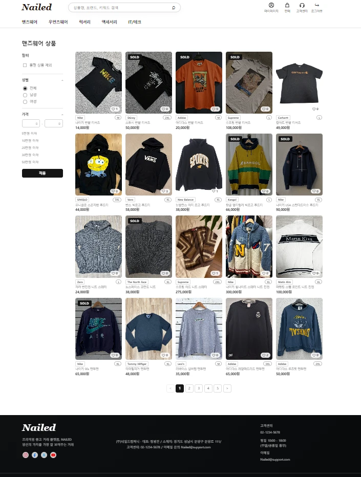
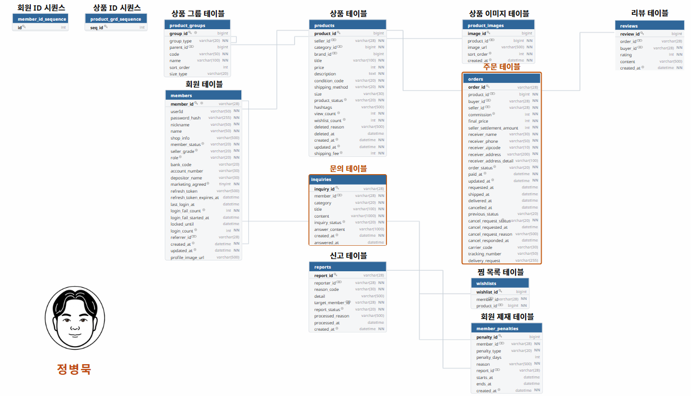

# 🛍️ Nailed — 중고거래 웹 플랫폼

[](https://github.com/jeongbyeongmug/nailed-springboot-react/actions/workflows/ci.yml)

> **주문 → 결제 → 정산 → CS**로 이어지는 이커머스 트랜잭션 흐름 전체를 설계·구현한 Spring Boot + React 풀스택 프로젝트입니다.

- **배포**: http://52.78.146.81/ ｜ **기간**: 2026.04 ~ 2026.06 ｜ **팀**: 3인
- **기술**: Java 21 · Spring Boot 3 · JPA · MySQL 8 · Spring Security(JWT) · React · AWS EC2 · Docker Compose
- **담당 (정병묵)**: 주문 · 결제 · 정산 · CS + 마이페이지/관리자(주문·문의)

<br>

## ⭐ 핵심 성과

### 1. 비관적 락으로 중복 주문 방지 — 2중 방어 + 실측 검증

재고 1개 상품에 동시 구매가 몰리면 중복 주문이 발생할 수 있습니다. 충돌 확률이 높은 도메인 특성상 낙관적 락(실패-재시도)보다 **비관적 락으로 선점 차단**하는 쪽을 택했습니다.

```java
// ProductRepository — 주문 시 상품 행에 쓰기 락(SELECT ... FOR UPDATE) 선점
@Lock(LockModeType.PESSIMISTIC_WRITE)
@Query("SELECT p FROM Product p WHERE p.productId = :productId")
Optional<Product> findByIdWithLock(@Param("productId") Long productId);
```

| 방어 | 트리거 | 응답 |
|---|---|---|
| **1차** | 락 대기 타임아웃(MySQL 1205) → `PessimisticLockingFailureException` | `O012` **409** |
| **2차** | 락 획득 후 상품이 이미 `SOLD` | `P002` **400** |

**실측 검증** — 실제 MySQL 통합 테스트로 결과를 assert 강제:
- `OrderConcurrencyTest` — 동시 **30건 → 성공 1 / 차단 29(전부 P002) / 상품 SOLD / 주문 1건**
- `OrderLockTimeoutTest` — 락 점유 중 후속 요청 **약 2초 만에 O012(409) 차단 / 주문 0 / 상품 ON_SALE 유지**

> **확장 고려** — 단일 인스턴스에선 DB 비관적 락으로 충분하지만, 다중 인스턴스에선 애플리케이션 레벨 분산 락(Redis/Redisson)이 필요합니다. `redisson-spring-boot-starter`는 부팅 시 Redis 연결을 강제해 Redis 없이는 기동이 실패하므로, 순수 `redisson` + `@Lazy`로 부팅을 안전화하는 지점까지 확인했습니다.

### 2. 금액·배송지 스냅샷 — 정책이 바뀌어도 과거 주문은 불변

수수료·정산금(`commission`, `final_price`, `seller_settlement_amount`)과 배송지를 **주문 시점에 확정 저장**했습니다. 수수료율 정책이 바뀌거나 회원이 주소를 수정해도 과거 주문의 정합성이 유지됩니다.

```
(상품가 + 배송비) × 수수료율 2% = 수수료 (10원 단위 반올림)
예) 490,000 + 4,000 = 494,000 → 수수료 9,880
    최종 결제 503,880 / 판매자 정산 494,000
```

정산은 배송완료(`DELIVERED`) 확정 후 판매자에게 지급되는 **에스크로** 방식입니다.

### 3. 트러블슈팅 — 원인을 끝까지 추적

- **`@Builder.Default` 누락 → 의도치 않은 UPDATE 쿼리**: Lombok `@Builder`가 필드 초기화 값을 무시해 `null`로 생성 → Hibernate dirty checking 오동작. 어노테이션 명시 + 팀 컨벤션화로 해결
- **배포 후 이미지 전부 깨짐**: SSH로 EC2 접속해 운영 DB를 직접 확인 → 이미지 URL에 `localhost:8080` 하드코딩이 원인. URL 생성을 환경별 설정 기반으로 수정하고 기존 데이터 일괄 보정

<br>

## 🖼 화면

| 홈 | 상품 목록 (SOLD) | 주문서 작성 |
| --- | --- | --- |
|  |  |  |

| 결제 완료 | 주문 상세 (상태) | 마이페이지 (등급·정산) |
| --- | --- | --- |
|  |  |  |

<br>

## 🗂 ERD



🟧 주황색 테이블(`orders`, `inquiries`)이 제가 설계·구현한 부분입니다. (전체 12개)

**`orders` 테이블 설계 의도**
- **금액·정산 스냅샷** (`commission` `final_price` `seller_settlement_amount`) — 주문 시점 확정, 정책 변경에도 불변
- **배송지 스냅샷** (`receiver_*`) — 회원 정보 변경과 무관하게 유지
- **상태별 타임스탬프 분리** (`paid_at`/`requested_at`/`shipped_at`/`delivered_at`) — 배송 추적·정산 시점 판단 근거
- **취소 컬럼군 분리** (`cancel_request_*`) — 취소 흐름 독립 추적
- **구매자·판매자 FK 동시 보유** (`buyer_id`+`seller_id`) — 마이페이지 구매/판매 내역 단일 조인 조회

<br>

## 👤 담당 구현 내용

**주문 상태 흐름**
```
PAID ──▶ REQUESTED ──▶ SHIPPING ──▶ DELIVERED
  │          │
  └──────────┴──▶ CANCELLED
```

- 결제완료(PAID)와 주문접수(REQUESTED)를 분리해 판매자 확인 단계를 명시화
- 주문 취소는 **구매자 본인 + PAID/REQUESTED 상태에서만** 허용, 취소 시 상품을 `ON_SALE`로 복구
- `ShippingService` 인터페이스 기반 **어댑터 패턴** — 실제 PG/택배사 연동 시 Mock 구현체만 교체(`MockShippingService`, `MockDeliveryTracker`)
- 배송완료 시 상품 `SOLD` 확정 + 판매자 등급 자동 재산정(`SellerGradeService`: DELIVERED 건수 기준 SILVER/GOLD/DIAMOND)
- 마이페이지 구매/판매/정산/문의 내역 — **Port 인터페이스**(`OrderMemberQueryPort`, `SettlementMemberQueryPort`)로 회원 도메인과 결합도 최소화
- 1:1 문의(등록·조회·답변) + 관리자 주문/문의 관리(`AdminOrderController`, `AdminInquiryController`)
- `GlobalExceptionHandler` + `ErrorCode`로 BE/FE 에러 응답 규격 통일

<br>

## 🏗 아키텍처 & 실행

```
Browser(React) ──▶ EC2 [ Docker Compose: Nginx(FE) ─▶ Spring Boot ─▶ MySQL 8 ]
```

- **인증** — Spring Security + JWT(Access / Refresh Token)
- **API 문서** — springdoc-openapi(Swagger UI) · `/swagger-ui/index.html`
- **CI** — push마다 GitHub Actions가 실제 MySQL 컨테이너로 백엔드 통합 테스트(동시성 포함 **총 19개**)를 실행 (`.github/workflows/ci.yml`)
- **관측성** — Spring Boot Actuator · `/actuator/health`(헬스체크) · `/actuator/metrics`(Micrometer)
- **확장** — 비관적 락이 DB 레벨이라 백엔드를 N대로 늘려도 동일 상품 주문은 같은 행 락으로 직렬화되어 안전(JVM 로컬 락이면 깨짐). Nginx 로드밸런싱 예시는 [`deploy/`](deploy/) 참고

```bash
cd backend && ./mvnw spring-boot:run                                          # 백엔드
cd frontend && npm install && npm run dev                                     # 프론트엔드
cd backend && ./mvnw -Dtest=OrderConcurrencyTest,OrderLockTimeoutTest test    # 동시성 테스트(로컬 MySQL)
docker compose up -d --build                                                  # 배포
```

<br>

## 👥 팀원

**정병묵** (주문/결제/정산/CS) · 정병민 (인증/회원/제재) · 윤성준 (상품/리뷰/홈/검색/찜)
